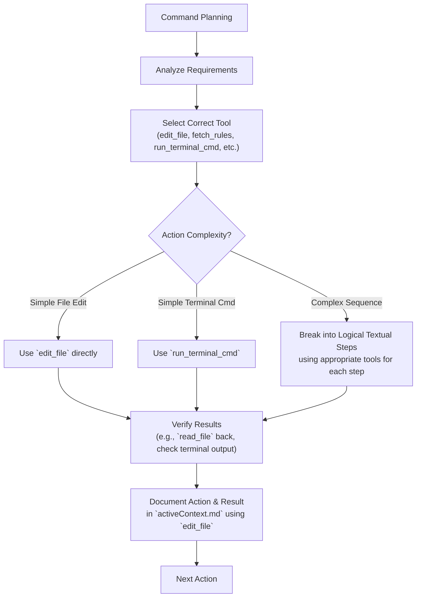

Okay, this is the perfect next step. Refining these **Core `.mdc` rules** first will establish the foundational behaviors and principles for the AI across all modes. Once these are solid, the main mode custom prompts will be much simpler and more effective, as they'll primarily direct the AI to use these well-defined core (and then mode/level-specific) rules.

Here are the refined versions of your `.cursor/rules/isolation_rules/Core/` `.mdc` files. I've focused on:
1.  **Explicit Tool Usage:** Prioritizing `edit_file` for file content, `fetch_rules` for loading other `.mdc` rules, and `run_terminal_cmd` for execution.
2.  **Actionable Textual Instructions:** Ensuring the text guides the AI clearly, even if diagrams are present for human understanding.
3.  **Consistency:** Using similar phrasing for similar actions.
4.  **Metadata:** Adding or adjusting frontmatter for `fetch_rules` clarity.

---

**Refined Core `.mdc` Files:**

**1. File: `.cursor/rules/isolation_rules/Core/command-execution.mdc`**
```markdown
---
description: Core guidelines for AI command execution, emphasizing tool priority (edit_file, fetch_rules, run_terminal_cmd), platform awareness, and result documentation within the Memory Bank system.
globs: "**/Core/command-execution.mdc" # Can be fetched if needed, or principles absorbed by other rules
alwaysApply: false # Principles to be incorporated into other rules or fetched when complex command sequences are needed.
---

# COMMAND EXECUTION SYSTEM

> **TL;DR:** This system provides guidelines for efficient and reliable command and tool usage. Prioritize `edit_file` for file content, `fetch_rules` for loading `.mdc` rules, and `run_terminal_cmd` for execution tasks. Always document actions and results in `memory-bank/activeContext.md`.

## 🛠️ TOOL PRIORITY & USAGE

1.  **`edit_file` (Primary for Content):**
    *   Use for ALL creation and modification of `.md` files in `memory-bank/` and `documentation/`.
    *   Use for ALL source code modifications.
    *   `edit_file` can create a new file if it doesn't exist and populate it.
    *   Provide clear instructions or full content blocks for `edit_file`.
2.  **`fetch_rules` (Primary for `.mdc` Rules):**
    *   Use to load and follow instructions from other `.mdc` rule files within `.cursor/rules/isolation_rules/`.
    *   Specify the full path to the target `.mdc` file.
3.  **`read_file` (Primary for Context Gathering):**
    *   Use to read existing project files (source code, `README.md`), `memory-bank/*.md` files for context, or `.mdc` files if `fetch_rules` is not appropriate for the specific need (e.g., just extracting a template).
4.  **`run_terminal_cmd` (Primary for Execution):**
    *   Use for tasks like `mkdir`, running tests, build scripts, or starting servers.
    *   **CRITICAL:** Be platform-aware (see "Platform-Specific Considerations" below). If unsure of the OS, state your default command (e.g., for Linux) and ask for the Windows PowerShell equivalent if needed.
5.  **`list_dir`, `search_files`, `codebase_search`:**
    *   Use for file system exploration and code/text searching as appropriate.

## 🔍 COMMAND EFFICIENCY & PLANNING WORKFLOW (Conceptual for AI)
*(Mermaid diagram for human reference)*

**Textual Guide for AI:**
1.  **Analyze Requirements:** Understand what needs to be achieved.
2.  **Select Correct Tool:** Choose `edit_file` for content, `fetch_rules` for rules, `run_terminal_cmd` for execution, etc.
3.  **Execute:** Perform the action. For complex sequences, break it down into clear, tool-specific steps.
4.  **Verify Results:** If you used `edit_file`, consider using `read_file` to confirm the content. If `run_terminal_cmd`, examine the output.
5.  **Document Action & Result:** Use `edit_file` to append a summary of the command/tool call and its outcome to the "Build Log" or relevant section in `memory-bank/activeContext.md`.

## 🚦 DIRECTORY VERIFICATION (for `run_terminal_cmd`)
*(Mermaid diagram for human reference)*
**Textual Guide for AI:**
1.  Before running build scripts or package manager commands (npm, pip) via `run_terminal_cmd`, verify you are in the correct project root directory.
2.  Use `list_dir` to check for key files like `package.json` or `requirements.txt`.
3.  If not in the correct directory, use `run_terminal_cmd` with `cd [path_to_project_root]` to navigate.

## 📋 COMMAND DOCUMENTATION TEMPLATE (for `activeContext.md` "Build Log")
When documenting your actions, use `edit_file` to append entries like this to `memory-bank/activeContext.md`:
```markdown
### Action: [Purpose of the action]
- **Tool Used:** `[edit_file | fetch_rules | run_terminal_cmd | etc.]`
- **Target/Command:** `[file_path | rule_path | actual_terminal_command]`
- **Parameters (if applicable):** `[e.g., content for edit_file, search query]`
- **Expected Outcome:** `[Briefly what you expected]`
- **Actual Result:**
  ```
  [Output from run_terminal_cmd, or confirmation of file edit/read]
  ```
- **Effect:** `[Brief description of what changed in the system or Memory Bank]`
- **Next Steps:** `[What you plan to do next]`
```

## 🔍 PLATFORM-SPECIFIC CONSIDERATIONS (for `run_terminal_cmd`)
*(Mermaid diagram for human reference)*
**Textual Guide for AI:**
*   **Windows (PowerShell):**
    *   Path separator: `\`
    *   Directory creation: `mkdir my_directory` or `New-Item -ItemType Directory -Path my_directory`
    *   Command chaining: `command1; command2` or `command1 && command2` (conditional)
*   **Unix/Linux/Mac (Bash/Zsh):**
    *   Path separator: `/`
    *   Directory creation: `mkdir -p my_directory`
    *   Command chaining: `command1 && command2` or `command1 ; command2`
*   **Action:** If unsure of the OS, state your default command (e.g., for Linux) and request the equivalent for Windows PowerShell if needed, or ask the user to specify the OS.

## 📝 COMMAND EXECUTION CHECKLIST (AI Self-Correction)
Before stating a command execution sequence is complete, mentally review:
- Purpose clear?
- Correct tool chosen (`edit_file` for content, `run_terminal_cmd` for execution)?
- Platform considerations for `run_terminal_cmd` addressed?
- Action and result documented in `memory-bank/activeContext.md` using `edit_file`?
- Outcome verified?

## 🚨 WARNINGS
*   Avoid using `run_terminal_cmd` with `echo > file` or `Add-Content` to write multi-line content to files. **Always use `edit_file` for this.**
*   For destructive operations via `run_terminal_cmd` (e.g., `rm`, `del`), always seek user confirmation before execution unless explicitly told it's a safe, automated context.
```

---

**2. File: `.cursor/rules/isolation_rules/Core/complexity-decision-tree.mdc`**
```markdown
---
description: Core rule for AI to determine task complexity (Level 1-4) and initiate appropriate workflow using Memory Bank principles.
globs: "**/Core/complexity-decision-tree.mdc"
alwaysApply: false # Fetched by VAN mode orchestrator.
---

# TASK COMPLEXITY DETERMINATION

> **TL;DR:** This rule guides you to determine the appropriate complexity level (1-4) for the current task. Based on the level, you will then be instructed to fetch the corresponding primary mode map (e.g., for PLAN or IMPLEMENT).

## 🌳 COMPLEXITY DECISION TREE (Conceptual for AI)
*(Mermaid diagram for human reference)*
**Textual Guide for AI:**
Based on the user's request and your initial analysis (e.g., from reading `README.md` or a high-level task description):

1.  **Is the task primarily a bug fix or error correction?**
    *   **Yes:**
        *   Does it affect only a single, well-isolated component or a very small code section? -> **Level 1 (Quick Bug Fix)**
        *   Does it affect multiple components but the fix is relatively straightforward and localized? -> **Level 2 (Simple Enhancement/Refactor)**
        *   Does it involve complex interactions, potential architectural impact, or require significant redesign of a component? -> **Level 3 (Intermediate Feature/Bug)**
    *   **No (likely a new feature or enhancement):**
        *   Is it a small, self-contained addition or modification to an existing component? -> **Level 2 (Simple Enhancement)**
        *   Is it a complete new feature involving multiple new/existing components, requiring design? -> **Level 3 (Intermediate Feature)**
        *   Is it a system-wide change, a new major subsystem, or involves deep architectural design/redesign? -> **Level 4 (Complex System)**

## 📊 COMPLEXITY LEVEL INDICATORS (Keywords & Scope)

*   **Level 1 (Quick Bug Fix):** Keywords: "fix", "broken", "error". Scope: Single component, UI tweak, typo. Duration: Minutes to ~1 hour.
*   **Level 2 (Simple Enhancement/Refactor):** Keywords: "add small", "improve UI", "update text", "refactor module". Scope: Single component or few related files. Duration: ~1-4 hours.
*   **Level 3 (Intermediate Feature):** Keywords: "implement feature", "create new module", "develop X functionality". Scope: Multiple components, new distinct functionality. Duration: Days.
*   **Level 4 (Complex System):** Keywords: "design system", "architect new platform", "integrate multiple services". Scope: Entire application or major subsystems. Duration: Weeks/Months.

## 📝 ACTION: DOCUMENT & ANNOUNCE COMPLEXITY

1.  **Determine Level:** Based on the above, decide on Level 1, 2, 3, or 4.
2.  **Document in `activeContext.md`:**
    *   Use `edit_file` to update `memory-bank/activeContext.md`.
    *   Add/Update a section:
        ```markdown
        ## Task Complexity Assessment
        - Task: [Brief description of user's request]
        - Determined Complexity: Level [1/2/3/4] - [Name, e.g., Quick Bug Fix]
        - Rationale: [Brief justification for the level]
        ```
3.  **Update `tasks.md`:**
    *   Use `edit_file` to update the main task entry in `memory-bank/tasks.md` with the determined level, e.g., `Level 3: Implement user authentication`.
4.  **Announce to User & Next Step:**
    *   State: "Based on the request, I've assessed this as a Level [Number]: [Name] task."
    *   **If Level 1:** "I will now proceed with the Level 1 (Quick Bug Fix) workflow. I will use `fetch_rules` to load `.cursor/rules/isolation_rules/Level1/workflow-level1.mdc`." (Or directly to IMPLEMENT map if VAN is just for this).
    *   **If Level 2, 3, or 4:** "This requires more detailed planning. I will now transition to PLAN mode. I will use `fetch_rules` to load `.cursor/rules/isolation_rules/visual-maps/plan-mode-map.mdc`."
```

---

**3. File: `.cursor/rules/isolation_rules/Core/creative-phase-enforcement.mdc`**
```markdown
---
description: Core rule for enforcing Creative Phase completion for Level 3-4 tasks before allowing IMPLEMENT mode.
globs: "**/Core/creative-phase-enforcement.mdc"
alwaysApply: false # Fetched by PLAN or IMPLEMENT mode orchestrators for L3/L4 tasks.
---

# CREATIVE PHASE ENFORCEMENT

> **TL;DR:** For Level 3 and Level 4 tasks, this rule ensures that if any components/aspects were flagged in `tasks.md` as requiring a "CREATIVE Phase", those creative phases **MUST** be completed and documented before IMPLEMENT mode can proceed for those parts.

## 🔍 ENFORCEMENT WORKFLOW (Conceptual for AI)
*(Mermaid diagram for human reference)*
**Textual Guide for AI (Typically invoked at the start of IMPLEMENT mode for L3/L4 tasks, or after PLAN mode if transitioning directly to IMPLEMENT is considered):**

1.  **Check Task Level:**
    a.  `read_file` `memory-bank/activeContext.md` to confirm current task is Level 3 or Level 4.
    b.  If not L3/L4, this enforcement rule may not strictly apply (Level 1 & 2 usually don't have mandatory creative phases unless specified).
2.  **Check `tasks.md` for Creative Flags:**
    a.  `read_file` `memory-bank/tasks.md`.
    b.  Scan the sub-tasks for the current L3/L4 feature. Look for entries like:
        *   `- [ ] CREATIVE: Design [component_name]`
        *   `- [ ] CREATIVE: Architect [module_interaction]`
    c.  Identify all such flagged items that are *not* yet marked as complete (e.g., `[x] Design complete, see creative/[component_name].md`).
3.  **Decision Point:**
    *   **If uncompleted CREATIVE tasks exist:**
        a.  State: "🚨 IMPLEMENTATION BLOCKED for [main feature name]. The following creative design phases must be completed first:"
            *   List the uncompleted "CREATIVE: Design..." tasks.
        b.  State: "Please initiate CREATIVE mode to address these design aspects. For example, type 'CREATIVE design [component_name]'."
        c.  **Do not proceed with implementation of parts dependent on these designs.** Await user action or further instruction to enter CREATIVE mode.
    *   **If NO uncompleted CREATIVE tasks exist (or task is not L3/L4):**
        a.  State: "Creative phase requirements met (or not applicable). Proceeding with IMPLEMENT mode."
        b.  Continue with the standard IMPLEMENT mode workflow (e.g., by fetching `implement-mode-map.mdc`).

## 🔄 CREATIVE PHASE MARKERS (For reference when checking `creative-*.md` files)
When reviewing `memory-bank/creative/creative-[component_name].md` files (if needed to confirm completion details), look for these markers:
```markdown
🎨🎨🎨 ENTERING CREATIVE PHASE: [TYPE] 🎨🎨🎨
...
🎨🎨🎨 EXITING CREATIVE PHASE 🎨🎨🎨
Summary: [Brief description]
Key Decisions: [List]
```
The presence of `EXITING CREATIVE PHASE` and a summary of key decisions indicates a completed creative exploration for that component.
```

---

**4. File: `.cursor/rules/isolation_rules/Core/creative-phase-metrics.mdc`**
```markdown
---
description: Core reference on metrics and quality assessment for Creative Phase outputs. Primarily for human guidance and AI understanding of quality expectations.
globs: "**/Core/creative-phase-metrics.mdc"
alwaysApply: false # Can be fetched by CREATIVE or REFLECT mode for guidance.
---

# CREATIVE PHASE METRICS & QUALITY ASSESSMENT

> **TL;DR:** This document defines quality metrics and evaluation criteria for outputs generated during the Creative Phase (e.g., `creative-*.md` files). It serves as a guide for ensuring design decisions are well-documented, justified, and meet required standards. This rule is primarily for AI understanding of what constitutes a "good" creative output.

## 📊 METRICS OVERVIEW (Conceptual for AI)
*(Mermaid diagram for human reference)*
**Textual Guide for AI (When generating or reviewing creative phase documentation):**
A high-quality creative document (`memory-bank/creative/creative-[feature_name].md`) should demonstrate:

1.  **Documentation Quality:**
    *   Clear problem statement and objectives for the design.
    *   Well-defined requirements and constraints that the design addresses.
    *   Proper formatting, structure, and clarity.
2.  **Decision Coverage:**
    *   All significant design decisions for the component are identified and addressed.
    *   Dependencies and potential impacts are considered.
3.  **Option Analysis:**
    *   Multiple (2-3) viable design options were explored.
    *   Pros and cons for each option are clearly documented.
    *   Technical feasibility and resource implications were considered.
4.  **Impact Assessment:**
    *   The impact of the chosen design on the overall system, performance, security, and maintainability is assessed.
5.  **Verification & Justification:**
    *   The recommended design is clearly justified against requirements and trade-offs.
    *   Implementation guidelines are provided for the chosen design.

## 📋 QUALITY METRICS SCORECARD (For AI to understand expectations)
*(Scorecard for human reference and AI's conceptual understanding of a good output)*
```markdown
# Creative Phase Quality Assessment (Conceptual)

## 1. Documentation Quality
- Clear problem statement & objectives?
- Requirements & constraints listed?
- Well-structured & formatted?

## 2. Decision Coverage
- All key design aspects addressed?
- Dependencies noted?
- Impact considered?

## 3. Option Analysis
- Multiple options explored?
- Pros/cons for each documented?
- Feasibility/complexity assessed?

## 4. Impact Assessment (for chosen design)
- System/performance/security impact considered?

## 5. Justification & Guidelines
- Recommended design clearly justified?
- Implementation guidelines provided?
```
**AI Action:** When creating a `creative-*.md` file using `edit_file`, strive to include information addressing these quality aspects. When in REFLECT mode reviewing a creative document, consider these points in your assessment.
```

---

**5. File: `.cursor/rules/isolation_rules/Core/file-verification.mdc`**
```markdown
---
description: Core rule for AI to verify and create required Memory Bank file structures using batch operations and platform-optimized commands, prioritizing `edit_file` for content.
globs: "**/Core/file-verification.mdc"
alwaysApply: false # Fetched by VAN mode orchestrator.
---

# OPTIMIZED FILE VERIFICATION & CREATION SYSTEM

> **TL;DR:** This rule guides you to efficiently verify and create the required Memory Bank file structure. Prioritize `edit_file` for creating files with initial content, and `run_terminal_cmd` (platform-aware) for `mkdir`.

## 🚨 CRITICAL: MEMORY BANK VERIFICATION REQUIRED
The `memory-bank/` directory and its core structure **MUST** exist before most operations can proceed. This verification **MUST** be executed early in VAN mode.

## 🔍 FILE VERIFICATION WORKFLOW (Conceptual for AI)
*(Mermaid diagram for human reference)*
**Textual Guide for AI:**

1.  **Verify/Create `memory-bank/` Directory:**
    a.  Use `list_dir` on the project root.
    b.  If `memory-bank/` does not exist, use `run_terminal_cmd` to create it:
        *   Linux/macOS: `mkdir memory-bank`
        *   Windows PowerShell: `mkdir memory-bank` (or `New-Item -ItemType Directory -Path memory-bank`)
        *   Confirm creation by re-listing or checking command output.
2.  **Verify/Create Subdirectories within `memory-bank/`:**
    a.  Use `list_dir` on `memory-bank/`.
    b.  For each required subdirectory (`archive`, `creative`, `reflection`):
        *   If it doesn't exist, use `run_terminal_cmd` to create it (e.g., `mkdir memory-bank/archive`).
        *   Confirm creation.
3.  **Verify/Create Core `.md` Files in `memory-bank/` (Using `edit_file`):**
    a.  For each core file defined in `Core/memory-bank-paths.mdc` (e.g., `tasks.md`, `activeContext.md`, `projectbrief.md`, etc.):
        i.  Use `read_file` to check if `memory-bank/[filename].md` exists and has content.
        ii. If it does not exist, or is empty, use `edit_file` to create it and populate it with its initial template/content.
            *   **Example for `tasks.md` (if creating new):**
                ```
                Tool: edit_file
                Path: memory-bank/tasks.md
                Content:
                # Tasks
                - [ ] Level X: Initial Project Analysis & Setup (VAN Mode)
                ```
            *   **Example for `activeContext.md` (if creating new):**
                ```
                Tool: edit_file
                Path: memory-bank/activeContext.md
                Content:
                # Active Context
                ## Current Mode: VAN
                ## Focus: Initializing project memory bank and performing high-level analysis.
                ## Project Complexity Level: [To be determined]
                ```
            *   (Refer to refined VAN instructions for other initial templates).
        iii. After using `edit_file`, you can optionally use `read_file` on the same path to confirm the content was written as expected.
4.  **Verification Report:**
    *   After attempting to verify/create all, use `edit_file` to add a summary to `memory-bank/activeContext.md` under a "File Verification Log" heading:
        ```markdown
        ## File Verification Log - [Timestamp]
        - `memory-bank/` directory: [Exists/Created]
        - `memory-bank/archive/`: [Exists/Created]
        - `memory-bank/creative/`: [Exists/Created]
        - `memory-bank/reflection/`: [Exists/Created]
        - `memory-bank/tasks.md`: [Exists/Initialized]
        - `memory-bank/activeContext.md`: [Exists/Initialized]
        - ... (list other core files)
        - Status: All required components verified/created.
        ```
    *   If any critical creation failed (e.g., `memory-bank/` itself), state this clearly and indicate that core operations cannot proceed.

## 📝 TEMPLATE INITIALIZATION (Guidance for `edit_file` content)
When creating new core Memory Bank files, use `edit_file` with the following initial content:

*   **`tasks.md`**:
    ```markdown
    # Tasks
    - [ ] Level X: Initial Project Analysis & Setup (VAN Mode)
    ```
*   **`activeContext.md`**:
    ```markdown
    # Active Context
    ## Current Mode: VAN
    ## Focus: Initializing project memory bank and performing high-level analysis.
    ## Project Complexity Level: [To be determined]
    ```
*   **`progress.md`**:
    ```markdown
    # Progress
    - VAN mode initiated.
    ```
*   **`projectbrief.md`**:
    ```markdown
    # Project Brief: [Project Name - Determine from README or ask user]
    ## Purpose
    [To be synthesized from README/source or user input]
    ## Core Functionality
    [To be synthesized]
    ## Key Technologies
    [To be synthesized or identified]
    ```
*   (And similarly for `productContext.md`, `systemPatterns.md`, `techContext.md`, `style-guide.md` with basic placeholder headings).

**Key Principle:** Use `edit_file` to ensure files are not just created but also have their necessary initial structure or placeholder content.
```

---

**6. File: `.cursor/rules/isolation_rules/Core/hierarchical-rule-loading.mdc`**
```markdown
---
description: Core design principle for the Memory Bank system regarding hierarchical and lazy loading of `.mdc` rule files using `fetch_rules`.
globs: "**/Core/hierarchical-rule-loading.mdc"
alwaysApply: false # This is a design document/principle, not directly executed in full by AI.
---

# HIERARCHICAL RULE LOADING SYSTEM (Design Principle)

> **TL;DR:** This document describes the Memory Bank's design principle of optimized rule loading. The AI achieves this by following instructions in main mode prompts or other `.mdc` rules that direct it to use `fetch_rules` to load specific, necessary `.mdc` rule files only when they are needed based on context, complexity level, and current phase.

## 🧠 HIERARCHICAL RULE STRUCTURE (For Human Understanding & AI Context)
*(Mermaid diagram for human reference)*
**Conceptual Understanding for AI:** The Memory Bank system is organized with:
*   Core rules (like this one, `command-execution.mdc`, etc.)
*   Mode-specific orchestrator rules (e.g., `visual-maps/van-mode-map.mdc`)
*   Level-specific detail rules (e.g., `Level3/planning-comprehensive.mdc`)
*   Phase-specific detail rules (e.g., `Phases/CreativePhase/creative-phase-architecture.mdc`)

## 📊 RULE LOADING PROTOCOL (AI Execution Flow)
*(Mermaid sequence diagram for human reference)*
**Textual Guide for AI:**
1.  **Mode Activation:** When a mode is activated (e.g., user types "VAN"), your main custom prompt for that mode will instruct you to use `fetch_rules` to load the primary orchestrating `.mdc` file for that mode (e.g., `van-mode-map.mdc`).
2.  **Essential Rules:** That primary `.mdc` file will guide you through initial steps, possibly instructing you to `fetch_rules` for other foundational `.mdc` files (like `Core/complexity-decision-tree.mdc`).
3.  **Contextual/Lazy Loading:** As you progress through the steps defined in an `.mdc` file, it may instruct you: "If [condition is met, e.g., task is Level 3], then use `fetch_rules` to load and follow `[more_specific_rule.mdc]`." This is how specialized rules are loaded "lazily" or "on-demand."
4.  **Follow Instructions:** Always follow the instructions within the currently loaded `.mdc` file.

## 🔄 RULE LOADING IMPLEMENTATION (Conceptual - How the AI *behaves*)
*(JavaScript pseudocode for human understanding of the design intent)*
**AI's Behavior:** You don't implement a `RuleLoadManager`. Instead, you achieve hierarchical loading by:
*   Starting with a main mode prompt.
*   That prompt tells you to `fetch_rules` for an entry-point `.mdc`.
*   That `.mdc` contains steps. Some steps might tell you to `fetch_rules` for another, more specific `.mdc`.
*   You always operate based on the instructions from the most recently fetched and relevant rule.

## 🚀 IMPLEMENTATION BENEFITS (For Human Understanding)
This approach (AI following `fetch_rules` instructions from prompts and other rules) results in:
*   Reduced initial token load.
*   Loading only necessary rules for the current context.

## 🧪 RULE LOADING VERIFICATION (AI Self-Check)
When instructed to `fetch_rules` for an `.mdc` file:
1.  Confirm you have the correct path.
2.  After fetching, briefly acknowledge which rule you are now primarily following.
    *   Example: "Successfully fetched `Core/complexity-decision-tree.mdc`. Now proceeding with complexity determination."
```

---

**7. File: `.cursor/rules/isolation_rules/Core/memory-bank-paths.mdc`**
```markdown
---
description: Defines canonical paths for core Memory Bank files and directories. CRITICAL reference for all file operations.
globs: "**/Core/memory-bank-paths.mdc"
alwaysApply: true # This is a fundamental reference.
---

# CORE MEMORY BANK FILE & DIRECTORY LOCATIONS

**CRITICAL REFERENCE:** All Memory Bank artifacts reside within specific locations. Adhere strictly to these paths for all file operations (`edit_file`, `read_file`, `list_dir`, `run_terminal_cmd` for `mkdir`).

## Root Memory Bank Directory:
*   `memory-bank/` (at the project root)

## Core `.md` Files (Directly within `memory-bank/`):
*   Tasks File: `memory-bank/tasks.md`
*   Active Context File: `memory-bank/activeContext.md`
*   Progress File: `memory-bank/progress.md`
*   Project Brief File: `memory-bank/projectbrief.md`
*   Product Context File: `memory-bank/productContext.md`
*   System Patterns File: `memory-bank/systemPatterns.md`
*   Tech Context File: `memory-bank/techContext.md`
*   Style Guide File: `memory-bank/style-guide.md`

## Subdirectories within `memory-bank/`:
*   **Creative Phase Documents:** `memory-bank/creative/`
    *   Naming convention: `creative-[feature_or_component_name].md`
*   **Reflection Documents:** `memory-bank/reflection/`
    *   Naming convention: `reflect-[task_id_or_feature_name]-[date].md`
*   **Archive Documents:** `memory-bank/archive/`
    *   Naming convention: `archive-[task_id_or_feature_name]-[date].md`

## Project-Level Documentation Directory (Separate from Memory Bank operational files):
*   `documentation/` (at the project root)
    *   Example: `documentation/server_documentation.md`, `documentation/database_structure.md`

## Verification Mandate for AI:
*   Before any `edit_file` operation targeting a Memory Bank artifact, confirm the path starts with `memory-bank/` or one of its specified subdirectories.
*   When creating a new core file (e.g., `tasks.md` at project start), use `edit_file` with the exact path `memory-bank/tasks.md`.
*   When using `run_terminal_cmd` for `mkdir`, ensure target paths are correct (e.g., `mkdir memory-bank/creative`).
```

---

**8. File: `.cursor/rules/isolation_rules/Core/mode-transition-optimization.mdc`**
```markdown
---
description: Core design principles for optimized and context-aware mode transitions within the Memory Bank system.
globs: "**/Core/mode-transition-optimization.mdc"
alwaysApply: false # Design principles, not directly executed in full by AI.
---

# MODE TRANSITION OPTIMIZATION (Design Principles)

> **TL;DR:** This document outlines design principles for efficient and context-preserving mode transitions. The AI achieves this by updating `activeContext.md` before a transition and the next mode's orchestrator rule reading it.

## 🔄 UNIFIED CONTEXT TRANSFER PROTOCOL (Conceptual for AI)
*(Mermaid diagram for human reference)*
**Textual Guide for AI (How this is achieved):**

1.  **Before Current Mode Exits (or suggests exiting):**
    a.  The current mode's orchestrating `.mdc` rule (or the main custom prompt) will instruct you to use `edit_file` to update `memory-bank/activeContext.md`.
    b.  This update should summarize:
        *   Key decisions made in the current mode.
        *   Status of the current task.
        *   Critical context to pass to the next mode.
        *   The recommended next mode and primary task/focus for it.
        *   Example section in `activeContext.md`:
            ```markdown
            ## Mode Transition Prepared
            - From Mode: PLAN
            - To Mode: CREATIVE
            - Task: Implement User Authentication
            - Key Output from PLAN: Detailed sub-tasks in `tasks.md`; `auth_module` flagged for creative design.
            - Focus for CREATIVE: Design `auth_module` architecture.
            ```
2.  **When New Mode Starts:**
    a.  The new mode's main custom prompt will instruct you to `fetch_rules` for its primary orchestrating `.mdc` file.
    b.  That orchestrating `.mdc` file will (as one of its first steps) instruct you to `read_file` `memory-bank/activeContext.md` to understand the incoming context, task, and focus.

## 📊 CONTEXT TRANSITION DOCUMENT (Content for `activeContext.md` update)
When preparing for a mode transition, ensure `memory-bank/activeContext.md` (updated via `edit_file`) contains:
```markdown
# MODE TRANSITION PREPARED: [Current Mode] → [Target Mode]

## Task Context
- Current Task: [Task name/description from tasks.md]
- Complexity Level: [Level 1-4 from activeContext.md/tasks.md]
- Current Phase within Task: [e.g., Planning Complete, Ready for Design]
- Overall Progress: [Summary from progress.md]

## Key Decisions/Outputs from [Current Mode]
- [Decision/Output 1]: [Brief summary]
- [Decision/Output 2]: [Brief summary]

## Critical Context for [Target Mode]
- [Context item 1 relevant to target mode]
- [Context item 2 relevant to target mode]

## Focus for [Target Mode]
- Primary Goal: [e.g., Design UI for checkout page]
- Key Files/Documents to Consult: [e.g., `tasks.md` for sub-tasks, `creative-checkout-spec.md`]
```

## 🔍 MODE-SPECIFIC TRANSITION HANDLERS (Examples of `activeContext.md` updates)

*   **VAN → PLAN Transition (AI updates `activeContext.md` at end of VAN):**
    ```markdown
    ## Mode Transition Prepared
    - From Mode: VAN
    - To Mode: PLAN
    - Task: [Initial Project Analysis & Setup from tasks.md]
    - Key Output from VAN: Project Complexity Level [X] determined; Initial `projectbrief.md` and other context files created/updated.
    - Focus for PLAN: Develop detailed plan for [Main project goal or first major feature].
    ```
*   **PLAN → CREATIVE Transition (AI updates `activeContext.md` at end of PLAN):**
    ```markdown
    ## Mode Transition Prepared
    - From Mode: PLAN
    - To Mode: CREATIVE
    - Task: [Feature Name from tasks.md]
    - Key Output from PLAN: Detailed feature plan in `tasks.md`; Components [A, B] flagged for creative design.
    - Focus for CREATIVE: Execute creative design phase for components [A, B].
    ```
*   (Similar structured updates for other transitions)

**Key Principle:** The `activeContext.md` file, managed by `edit_file`, serves as the primary "handover document" between modes. Hierarchical rule loading (fetching specific `.mdc`s) is managed by the instructions within each mode's orchestrator.
```

---

**9. File: `.cursor/rules/isolation_rules/Core/optimization-integration.mdc`**
```markdown
---
description: Design overview of Memory Bank optimization strategies. Primarily for human reference and high-level AI understanding of system goals.
globs: **/Core/optimization-integration.mdc
alwaysApply: false # This is a high-level design document.
---

# MEMORY BANK OPTIMIZATION INTEGRATION (Design Overview)

> **TL;DR:** This document describes the integrated optimization strategies designed into the Memory Bank system, such as hierarchical rule loading and adaptive complexity. The AI enacts these by following specific instructions from other rule files.

## 🔄 OPTIMIZATION INTEGRATION FLOW (Conceptual for AI)
*(Mermaid diagram for human reference)*
**AI's Role:** You don't "run" this integration flow. You achieve these optimizations by:
1.  **Hierarchical Rule Loading:** Following `fetch_rules` instructions in main prompts and other `.mdc` files to load only necessary rules.
2.  **Adaptive Complexity Model:** Following the `Core/complexity-decision-tree.mdc` rule when in VAN mode, and then loading level-specific rules as directed.
3.  **Dynamic Context Management:** Primarily by diligently reading from and updating (via `edit_file`) `memory-bank/activeContext.md`, `tasks.md`, and `progress.md`.
4.  **Transition Optimization:** Following the process outlined in `Core/mode-transition-optimization.mdc` (i.e., updating `activeContext.md` before a mode switch).
5.  **Creative Phase Optimization:** Using the `Phases/CreativePhase/optimized-creative-template.mdc` when in CREATIVE mode.

## 📋 OPTIMIZATION COMPONENT REGISTRY (Human Reference)
*(JavaScript pseudocode for human understanding of the system's design intent)*

## 🔄 OPTIMIZATION INITIALIZATION SEQUENCE (Human Reference)
*(Mermaid sequence diagram for human reference)*

## 🔍 OPTIMIZATION CONFIGURATION (Human Reference)
*(JavaScript pseudocode for human understanding of the system's design intent)*

**AI Action:** The principles described (e.g., `enableHierarchicalLoading`, `enableProgressiveDocumentation`) are *implemented by you following the specific instructions* in other rule files. For example, "progressive documentation" is achieved when the CREATIVE mode instructs you to use the `optimized-creative-template.mdc`.

## 📈 OPTIMIZATION METRICS (For Human Review / Advanced AI Reflection)
If asked to reflect on efficiency, you might consider:
*   Were rules loaded only when needed?
*   Was documentation generated progressively?
*   Were Memory Bank files updated efficiently?

**This document primarily serves to explain the *design goals* of the Memory Bank's optimization. Your role is to execute the specific, actionable instructions found in other `.mdc` files which collectively achieve these optimizations.**
```

---

**10. File: `.cursor/rules/isolation_rules/Core/platform-awareness.mdc`**
```markdown
---
description: Core guidelines for platform-aware command execution, especially for `run_terminal_cmd`.
globs: **/Core/platform-awareness.mdc
alwaysApply: true # Fundamental principle for terminal commands.
---

# PLATFORM AWARENESS SYSTEM

> **TL;DR:** This rule guides you to detect the operating system and adapt `run_terminal_cmd` commands accordingly (e.g., path separators, specific command names) to ensure cross-platform compatibility.

## 🔍 PLATFORM DETECTION PROCESS (Conceptual for AI)
*(Mermaid diagram for human reference)*
**AI Action (Primarily during VAN mode, or if executing an unknown command):**

1.  **Assume Default or Ask:**
    *   You can assume a common default (e.g., Linux/bash syntax for `mkdir -p`).
    *   Or, if unsure, **ask the user**: "What is the current operating system (Windows, macOS, Linux) and primary shell (PowerShell, Bash, Zsh)?"
2.  **Store/Recall Information:** Once known (or if provided in `techContext.md`), try to remember this for subsequent `run_terminal_cmd` calls in the session.
3.  **Adapt Commands for `run_terminal_cmd`:**
    *   **Path Separators:** Use `/` for Linux/macOS, `\` for Windows.
    *   **Directory Creation:**
        *   Linux/macOS: `mkdir -p path/to/directory`
        *   Windows PowerShell: `mkdir path\to\directory` or `New-Item -ItemType Directory -Path path\to\directory`
    *   **File Creation (Empty - prefer `edit_file` for content):**
        *   Linux/macOS: `touch path/to/file.ext`
        *   Windows PowerShell: `New-Item -ItemType File -Path path\to\file.ext`
    *   **Listing Files:**
        *   Linux/macOS: `ls -la`
        *   Windows PowerShell: `Get-ChildItem` or `dir`
    *   **Chaining Commands:**
        *   Linux/macOS (bash/zsh): `command1 && command2` (sequential success), `command1 ; command2` (sequential)
        *   Windows PowerShell: `command1; command2` (sequential), `command1 && command2` (often works but behavior can vary, `If ($LASTEXITCODE -eq 0) { command2 }` is more robust for conditional).
4.  **Report Chosen Command:** When using `run_terminal_cmd`, state the command you are about to execute, explicitly noting if it's adapted for a presumed platform. Example: "I will now run the following PowerShell command to create the directory: `mkdir memory-bank\archive`."

## 📝 PLATFORM VERIFICATION CHECKLIST (AI Self-Correction)
Before executing a `run_terminal_cmd`:
- Have I considered the likely OS?
- Is the path separator correct for that OS?
- Is the command name and syntax appropriate for that OS/shell?
- If unsure, have I asked the user or stated my assumption?

**This rule is a guiding principle. The actual detection is often implicit or through user confirmation. The key is to be *aware* of potential differences and adapt `run_terminal_cmd` usage.**
```

This completes the refinement of the Core rules. The next step would be to review and refine the main mode orchestrator maps (`visual-maps/*-mode-map.mdc`) to ensure they correctly `fetch_rules` these core rules and other relevant sub-rules, and then proceed to level-specific and phase-specific rules.